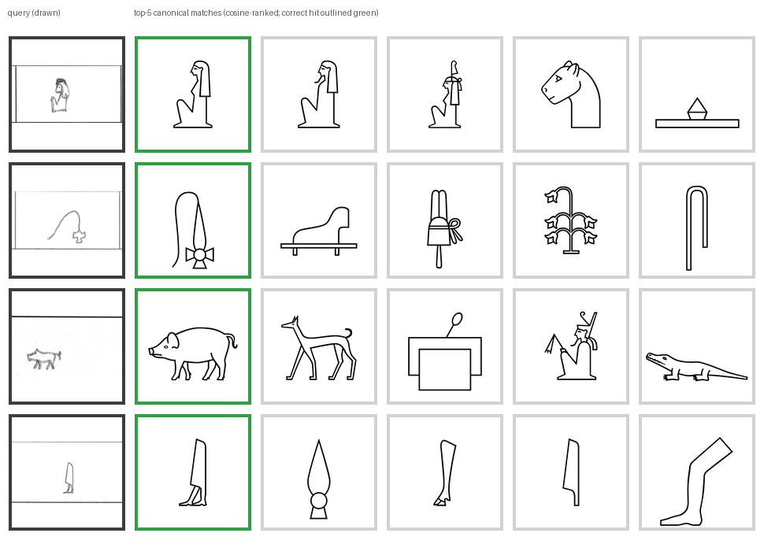
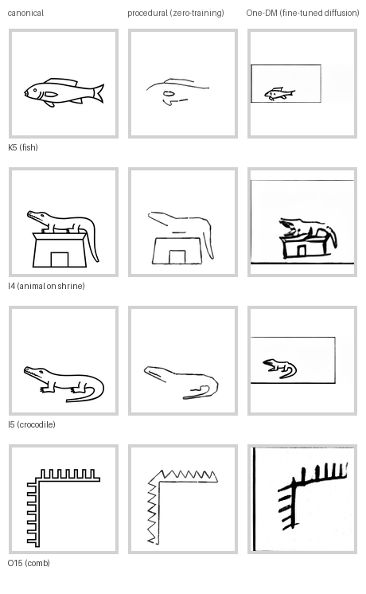

# egyptian_hiero

Two product pipelines around Gardiner-sign Egyptian hieroglyphs, both built to
generalize to any symbol inventory / ancient script:

1. **Generation** (`pipelines/generation/`) — produce human-looking handwriting
   samples for any canonical symbol (procedural engine, zero training; or
   [One-DM](#citations-and-acknowledgements) latent-diffusion style mimicry, fine-tuned).
2. **Matching** (`pipelines/matching/`) — recognize a drawn/handwritten symbol
   against a canonical-glyph inventory (dictionary-app backend; open-set,
   metric-learning encoder + nearest-prototype index).

Start here: **[`pipelines/README.md`](pipelines/README.md)** for the map and
both runbooks.

## Results

Full HPC (A100) training, reviewer-grade stress testing, and repro commands
are in each pipeline's README: [`pipelines/matching/README.md`](pipelines/matching/README.md),
[`pipelines/generation/README.md`](pipelines/generation/README.md).

**Matching** (production model `pipelines/matching/runs/default`, resnet34@160,
100 epochs + missing-stroke augmentation): 
* Held-out handwriting retrieval top-1 **0.971** / top-5 0.985 (n=4521)
* Unseen-writer (handwriting from a person not in the training data) probe top-1 **0.863** / top-5 0.988 (n=256)
* Corruption robustness (n=800/case): clean 0.966, shaky-hand wobble 0.938, 28%-block
occlusion 0.868, severed/missing strokes 0.779; blur and low-resolution
capture remain the sharpest failure modes (~0.40–0.46), i.e. degraded capture
hurts more than degraded drawing.

<p align="center">
  
</p>
<p align="center"><em>Real held-out handwriting queries (never seen in training), run through the production model. Column 1: the drawn query. Columns 2–6: its top-5 canonical matches by cosine similarity — correct hit outlined green, always ranked first here.</em></p>

**Generation** — two complementary engines, not two attempts at the same
thing:
* **Procedural** (skeletonize canonical → re-stroke with wobble/pressure,
zero training, CPU, any symbol): deterministic, always on-class, the reliable
default. 
* **One-DM** (latent diffusion, style-conditioned, fine-tuned on real
handwriting): recognizability of its output is top-1 **0.567** / top-5 0.600 on held-out signs which is more indicative of flaws in the generator than in the matcher. A synthetic-data feedback loop (One-DM output → matcher training) was
built with anti-collapse guardrails and tested but currently not used due to the flawed-generator (see [`pipelines/matching/README.md`](pipelines/matching/README.md) for more details).

<p align="center">
  
</p>
<p align="center"><em>Four signs, both engines, same canonical source. Procedural output is deterministic and always on-class every time; One-DM output is real production-model inference, selected for legibility from a wider, lower-quality sample.</em></p>

## Repository layout

| Path | Contents |
|---|---|
| `app/` | **Hieroglyph Dictionary** — installable PWA (Android/iOS phone + tablet): draw a sign, get the top-5 canonical matches, tap through to its meaning; all inference on-device (see `app/README.md`) |
| `pipelines/` | The two product pipelines (generation, matching) + `showcase/` (README figures above) |
| `One-DM/` | Vendored + extended [One-DM](#citations-and-acknowledgements) diffusion handwriting generator (the learned generation engine) |
| `hiero_data/` | Datasets: the [Hand-drawn Hieroglyph Dataset](#citations-and-acknowledgements) (handwriting) and the `archaeohack-starterpack` (canonical glyphs, Gardiner↔Unicode mapping, font, single-writer probe set) |
| `misc/` | Shared procedural scripts, portable `uv`-based environments, project notes (`PROJECT_NOTES.md`, `RESETUP.md`, `REJECTED_SOFTWARE.md`) |
| `slurm/` | SLURM job scripts for HPC training/evaluation (reproduction record for the results above) |

## Setup

```bash
bash misc/resetup.sh
```

Rebuilds all three environments (main scripts, One-DM, matching) relative to
wherever the repo lives. See `misc/RESETUP.md` for details and GPU notes.

## What's not in this repo

Large, regenerable artifacts are excluded via `.gitignore` rather than
committed: raw datasets (`hiero_data/Hand-drawn Hieroglyph Dataset/`,
`One-DM/data/hiero*/`), model weights (`One-DM/model_zoo/`, `One-DM/Saved/`,
`*.pt`/`*.pth` checkpoints, `app/data/model.onnx`), SLURM job logs (`slurm/logs/`), and the
`.venv`/tool caches that `misc/resetup.sh` rebuilds. Small evidence artifacts
that make results reproducible/auditable without the raw data — matcher
eval/stress JSONs and prototype indexes under `pipelines/matching/runs/`, and
the prepped-dataset metadata under `One-DM/data/` — are kept.

## Citations and acknowledgements

This project builds on:

**One-DM** (the diffusion-based generation engine, `One-DM/`):
```bibtex
@inproceedings{one-dm2024,
  title={One-Shot Diffusion Mimicker for Handwritten Text Generation},
  author={Dai, Gang and Zhang, Yifan and Ke, Quhui and Guo, Qiangya and Huang, Shuangping},
  booktitle={European Conference on Computer Vision},
  year={2024}
}
```
[github.com/dailenson/One-DM](https://github.com/dailenson/One-DM) ·
[arXiv:2409.04004](https://arxiv.org/abs/2409.04004)

**Hand-drawn Hieroglyph Dataset** (the handwriting corpus,
`hiero_data/Hand-drawn Hieroglyph Dataset/`):
```bibtex
@inproceedings{aneesh2024hieroglyph,
  title={Exploring Hieroglyph Recognition: A Deep Learning Approach},
  author={Aneesh, N. A. and Somasundaram, Anush and Ameen, Azhar and Garimella, Govind Sreekar and Jayashree, R.},
  booktitle={2024 2nd International Conference on Computer, Communication and Control (IC4)},
  year={2024},
  doi={10.1109/IC457434.2024.10486368}
}
```
[IEEE Xplore](https://ieeexplore.ieee.org/document/10486368)

**archaeohack-starterpack** (canonical Gardiner glyphs, Unicode mapping,
font): [github.com/ArchaeoHack/archaeohack-starterpack](https://github.com/ArchaeoHack/archaeohack-starterpack)

In addition, this project originates from and builds upon work from the [ArchaeoHack 2025 hackathon](https://archaeohack-evfhl.wordpress.com/), 
and has been assisted by Claude Fable 5, Opus 4.8 and Sonnet 5.
