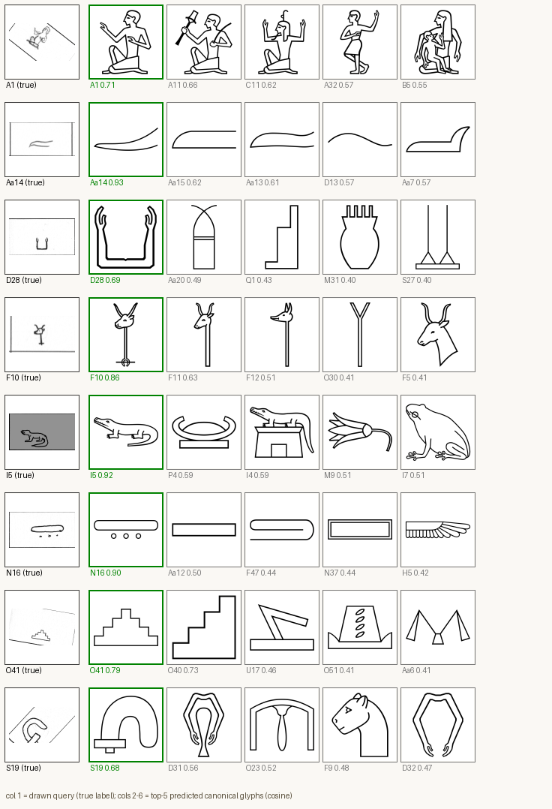
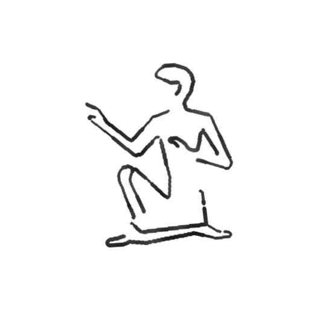
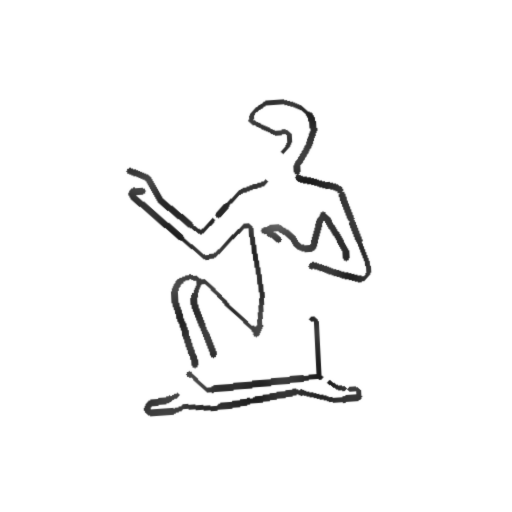

# egyptian_hiero

Two product pipelines around Gardiner-sign Egyptian hieroglyphs, both built to
generalize to any symbol inventory / ancient script:

1. **Generation** (`pipelines/generation/`) — produce human-looking handwriting
   samples for any canonical symbol (procedural engine, zero training; or
   [One-DM](#citations-and-acknowledgements) latent-diffusion style mimicry, fine-tuned).
2. **Matching** (`pipelines/matching/`) — recognize a drawn/handwritten symbol
   against a canonical-glyph inventory (dictionary-app backend; open-set,
   metric-learning encoder + nearest-prototype index).

Start here: **[`pipelines/README.md`](pipelines/README.md)** for the map and
both runbooks.

## Preliminary results

(See [`pipelines/smoke_results/README.md`](pipelines/smoke_results/README.md)
for more details)

**Matching** — resnet18@112, only 3 epochs, **8/8 top-1** on held-out
handwriting queries below (held-out set overall: top-1 **0.905**, top-5
0.964, n=800; the harder unseen-writer probe: top-1 0.859, n=256 — full
numbers in the smoke-results report):

<p align="center">
  
</p>
<p align="center"><em>Column 1: drawn query (true label). Columns 2–6: top-5 predicted canonical glyphs by cosine similarity, correct hit outlined green.</em></p>

**Generation** — procedural engine (zero-training, production-usable today):
two independent samples of the same canonical sign (A1; see first row above), each with its own
pen wobble, width, and pressure variation:

<p align="center">
  
  
</p>

## Repository layout

| Path | Contents |
|---|---|
| `pipelines/` | The two product pipelines + `smoke_results/` (proof-of-work evidence) |
| `One-DM/` | Vendored + extended [One-DM](#citations-and-acknowledgements) diffusion handwriting generator (the learned generation engine) |
| `hiero_data/` | Datasets: the [Hand-drawn Hieroglyph Dataset](#citations-and-acknowledgements) (handwriting) and the `archaeohack-starterpack` (canonical glyphs, Gardiner↔Unicode mapping, font, single-writer probe set) |
| `misc/` | Shared procedural scripts, portable `uv`-based environments, project notes (`PROJECT_NOTES.md`, `RESETUP.md`, `REJECTED_SOFTWARE.md`) |

## Setup

```bash
bash misc/resetup.sh
```

Rebuilds all three environments (main scripts, One-DM, matching) relative to
wherever the repo lives. See `misc/RESETUP.md` for details and GPU notes.

## What's not in this repo

Large, regenerable artifacts are excluded via `.gitignore` rather than
committed: raw datasets (`hiero_data/Hand-drawn Hieroglyph Dataset/`,
`One-DM/data/hiero/`), model weights (`One-DM/model_zoo/`, `*.pt`/`*.pth`
checkpoints), and the `.venv`/tool caches that `misc/resetup.sh` rebuilds.
`pipelines/smoke_results/` and the small prepped-dataset metadata under
`One-DM/data/` are kept so the repo is self-explanatory without them.

## Citations and acknowledgements

This project builds on:

**One-DM** (the diffusion-based generation engine, `One-DM/`):
```bibtex
@inproceedings{one-dm2024,
  title={One-Shot Diffusion Mimicker for Handwritten Text Generation},
  author={Dai, Gang and Zhang, Yifan and Ke, Quhui and Guo, Qiangya and Huang, Shuangping},
  booktitle={European Conference on Computer Vision},
  year={2024}
}
```
[github.com/dailenson/One-DM](https://github.com/dailenson/One-DM) ·
[arXiv:2409.04004](https://arxiv.org/abs/2409.04004)

**Hand-drawn Hieroglyph Dataset** (the handwriting corpus,
`hiero_data/Hand-drawn Hieroglyph Dataset/`):
```bibtex
@inproceedings{aneesh2024hieroglyph,
  title={Exploring Hieroglyph Recognition: A Deep Learning Approach},
  author={Aneesh, N. A. and Somasundaram, Anush and Ameen, Azhar and Garimella, Govind Sreekar and Jayashree, R.},
  booktitle={2024 2nd International Conference on Computer, Communication and Control (IC4)},
  year={2024},
  doi={10.1109/IC457434.2024.10486368}
}
```
[IEEE Xplore](https://ieeexplore.ieee.org/document/10486368)

**archaeohack-starterpack** (canonical Gardiner glyphs, Unicode mapping,
font): [github.com/ArchaeoHack/archaeohack-starterpack](https://github.com/ArchaeoHack/archaeohack-starterpack)

In addition, this project originates from and builds upon work from the [ArchaeoHack 2025 hackathon](https://archaeohack-evfhl.wordpress.com/), 
and has been assisted by Claude Fable 5, Opus 4.8 and Sonnet 5.
